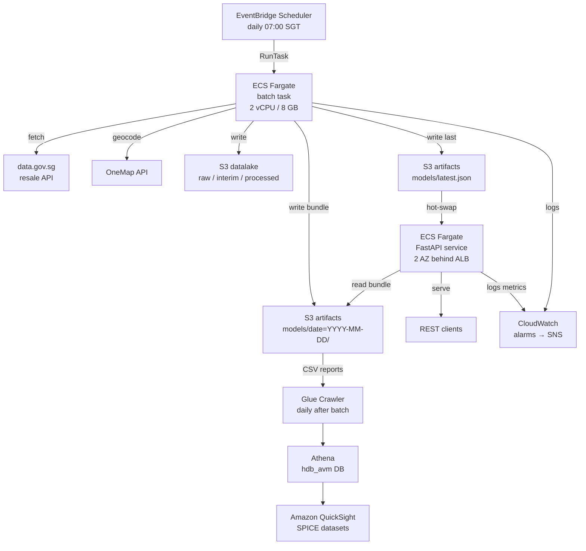

# Architecture

## System overview



## Storage layout

```
s3://hdb-avm-artifacts/
  models/
    date=YYYY-MM-DD/
      avm_ensemble.pkl
      preprocessor.pkl
      feature_names.json
      manifest.json          # { run_date, metrics, latest_macro, collinearity_dropped }
    latest.json              # pointer — written last on success
  reports/
    date=YYYY-MM-DD/         # Athena partition key
      model_metrics.csv
      feature_importance.csv
      validation_report.html
      backtest_metrics.csv
      backtest_bias_*.csv/png
      collinearity_report*.csv

s3://hdb-avm-datalake/
  raw/
  interim/
  processed/
```

## Key design decisions

| Decision | Choice | Rationale |
|---|---|---|
| Storage abstraction | fsspec + s3fs | Same code for local dev and S3 — zero config switch |
| Orchestration | EventBridge + Fargate | Serverless, no idle cost; simpler than Airflow for a daily single-stage job |
| Model bundle | `AVMModelBundle` | Preprocessor + ensemble travel together; prevents inference-time mismatch |
| Model pointer | `latest.json` | Enables instant rollback by repointing to any prior `date=` prefix |
| Front-end | Amazon QuickSight | Zero infrastructure; SPICE auto-refreshes after Glue crawler runs |
| IaC | Terraform | Reproducible; state in S3 + DynamoDB lock |
| CI auth | GitHub Actions OIDC | No long-lived AWS keys in repo |
